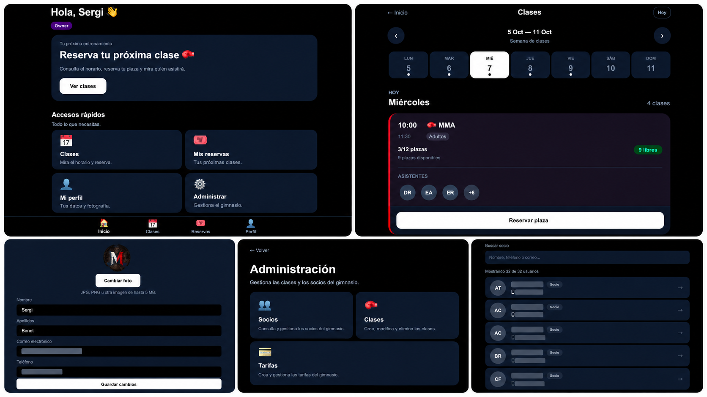

# 🥊 Gym Management SaaS

### Plataforma SaaS para la gestión de gimnasios de deportes de contacto

Proyecto orientado a gimnasios y academias de **MMA, Jiu-Jitsu, Grappling y Boxeo**, diseñado para simplificar la gestión diaria de socios, entrenadores, clases, tarifas y reservas.

> 🚧 Proyecto actualmente en desarrollo.

---

## 🎯 Objetivo del proyecto

El objetivo es desarrollar una plataforma sencilla y especializada para pequeños y medianos gimnasios de deportes de contacto.

La aplicación busca centralizar la gestión del gimnasio y ofrecer una experiencia sencilla tanto para los propietarios y entrenadores como para los socios.

---

## 🚀 Funcionalidades implementadas

### 👑 Owner
- Control general de la plataforma.
- Gestión de administradores.
- Gestión de entrenadores.
- Gestión de socios.
- Gestión de tarifas.
- Gestión de clases.

### ⚙️ Administrador
- Gestión de socios.
- Asignación de tarifas.
- Gestión de entrenadores.
- Creación, edición y eliminación de clases.
- Gestión de tarifas del gimnasio.

### 🥊 Trainer
- Acceso específico para entrenadores.
- Creación de clases.
- Eliminación de clases.
- Permisos restringidos respecto al administrador.

### 👤 Socio
- Registro e inicio de sesión.
- Acceso al gimnasio mediante código.
- Perfil personal.
- Consulta de clases disponibles.
- Reserva y cancelación de plazas.
- Consulta de próximas reservas.
- Restricciones de reserva según la tarifa contratada.

---

## 🏢 Arquitectura multi-gimnasio

La plataforma está diseñada para permitir la gestión independiente de diferentes gimnasios.

Cada gimnasio dispone de sus propios:

- Socios.
- Administradores y entrenadores.
- Clases.
- Reservas.
- Tarifas.
- Código de acceso.

---

## 🔐 Seguridad

La aplicación cuenta con diferentes niveles de permisos:

- Owner
- Administrador
- Trainer
- Socio

La separación de datos y los permisos también se controlan a nivel de base de datos mediante políticas de seguridad.

---

## 🛠️ Tecnologías utilizadas

- Next.js
- React
- TypeScript
- Tailwind CSS
- Supabase
- PostgreSQL
- Row Level Security (RLS)
- Git
- GitHub
- Netlify

---

## 📸 Capturas

Vista general de la plataforma y algunas de sus principales funcionalidades:

.

---

## 📈 Próximas mejoras

- Gestión de mensualidades y pagos.
- Dashboard para propietarios.
- Estadísticas del gimnasio.
- Automatización del alta de nuevos gimnasios.
- Sistema de suscripción para gimnasios.
- Mejoras basadas en el feedback de gimnasios reales.

---

## 💡 Sobre el proyecto

Este proyecto nace con la intención de crear una solución especializada para la gestión de gimnasios de deportes de contacto, evitando la complejidad innecesaria de plataformas deportivas más generalistas.

El desarrollo incluye tanto la interfaz de usuario como la arquitectura de base de datos, autenticación, permisos, seguridad y despliegue en producción.

---

## 👨‍💻 Autor

**Sergi Bonet**

Proyecto personal de desarrollo web y SaaS.

---

⭐ Proyecto en desarrollo y evolución continua.
